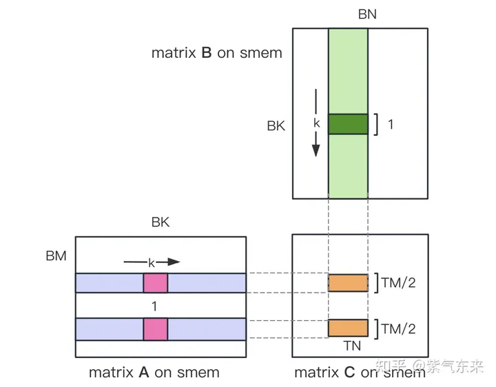

# cublas build
1. ```bash
   $ nvcc main.cu -o cublas_learn -lcublas
   $ ./cublas_learn
2. 修改CMakeLists.txt
   * target_link_libraries(untitled1  cublas)

# shared_momery_v2如何解决bank_conflict?
Shared Memory一共划分为32个Bank，每个Bank的宽度为4 Bytes，如果需要访问同一个Bank的多个数据，就会发生Bank Conflict。例如一个Warp的32个线程，如果访问的地址分别为0、4、8、...、124，就不会发生Bank Conflict，只占用Shared Memory一拍的时间；如果访问的地址为0、8、16、...、248，这样一来地址0和地址128对应的数据位于同一Bank、地址4和地址132对应的数据位于同一Bank，以此类推，那么就需要占用Shared Memory两拍的时间才能读出。

i) 为矩阵 A 
分配Shared Memory时形状分配为[BK][BM]，即让矩阵
在Shared Memory中按列存储

ii) 将原本每个线程负责计算的TM * TN的矩阵 C
，划分为下图中这样的两块TM/2 * TN的矩阵 C
，由于TM/2=4，一条指令即可完成A的一块的load操作，两个load可同时进行。
